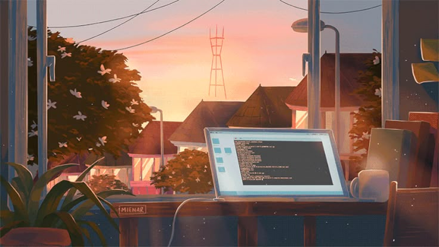

  

Étudiant en BUT Informatique à l’Université de Strasbourg, passionné par le développement d’applications et le jeu vidéo. J’aime créer, apprendre et progresser à travers des projets variés, qu’ils soient personnels ou issus de mes études. Grand amateur de jeux compétitifs comme League of Legends, Valorant ou Overwatch, je cherche à associer mes passions et mes compétences techniques pour concevoir des projets qui me ressemblent.

# 💻 Tech Stack:
            

---
